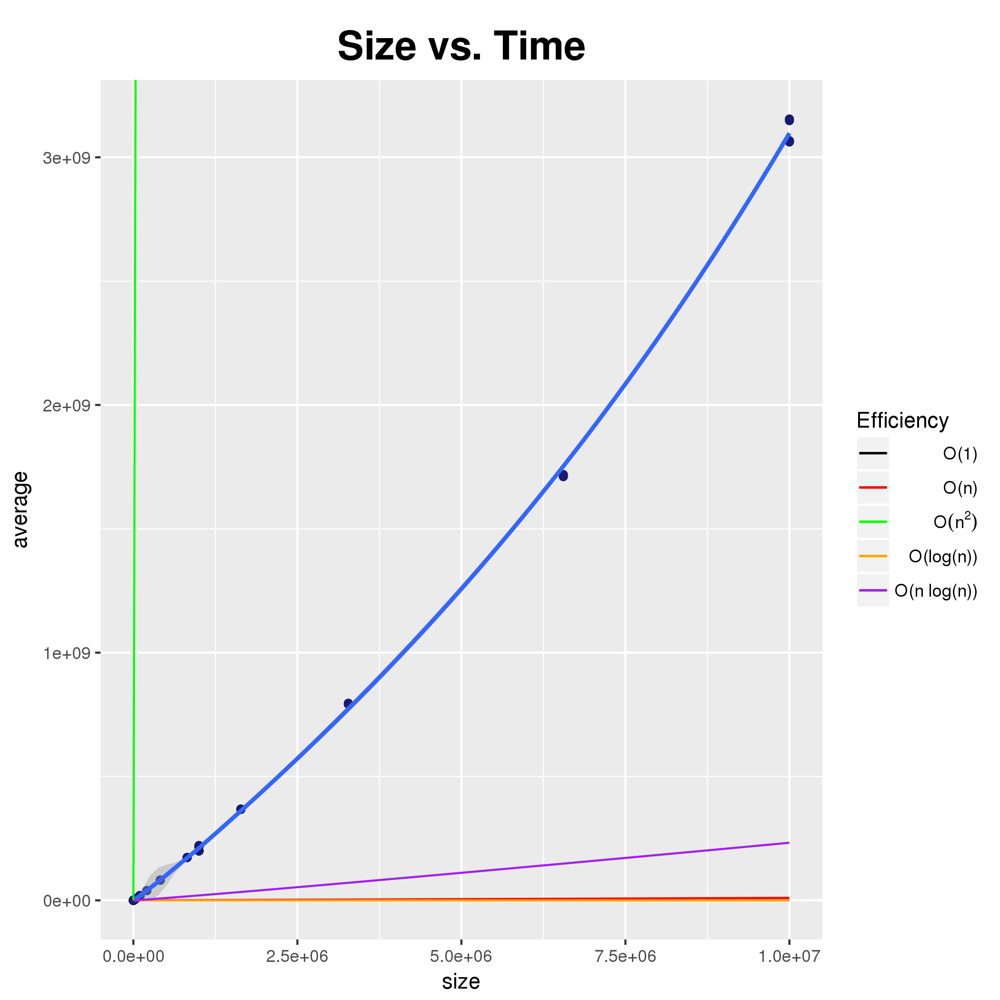

# MergeSortTest

To find the rough execution time of merge sort, a small program was created to
run the algorithm many times and find the average by dividing the total time
spent by the number of times the algorithm is run. Later on, more functionality
was added, including the ability to utilize multiple threads.

## MergeSortTest.java

Multiple arguments can optionally be passed to the program. One can specify the
initial size of the dataset, the number of runs to perform per size, and the
number of tests to perform per run. Compilation requires the JDK to be
installed. It uses `n - 1` threads to attempt to keep your computer somewhat
responsive while it runs, where `n` is the number of logical processors your
machine has.

    javac *.java && java -server -d64 MergeSortTest 100 5 10000 | tee -a results.csv

The JVM [takes a while][1] to start up, which might negatively influence
results. Therefore, it is important to either run significantly more rounds and
average out the results so that outliers are "smoothed out" or run a few more
rounds and discard earlier data. As of right now, it is simpler to just run more
rounds because the number of iterations it takes for the JVM to fully optimize
code is different for each computer.

The program will run until terminated, printing to standard output using a csv
format every time it finishes a test. Output from one run of the program might
look like:

    Running 3 runs with 1000000 tests per run using 3 parallel threads.
    size,average (ns)
    100,15380
    100,16450
    100,17055

## analyze.R

The first argument passed should be the path to the results csv. ggplot2 is used
to plot all the data points, the regression, and some reference lines. Output is
saved to `plot.png`. The program requires R to be installed on the system:

    Rscript analyze.R results.csv

For optimal results, there should be many data points for a variety of array
sizes.

From this, it seems like the Big-Oh classification of merge sort is **O(n
log(n))**, but more data points are needed to make sure.

TODO:

- Test with different `-XX:CompileThreshold` values.

[1]: http://stackoverflow.com/questions/36198278/

